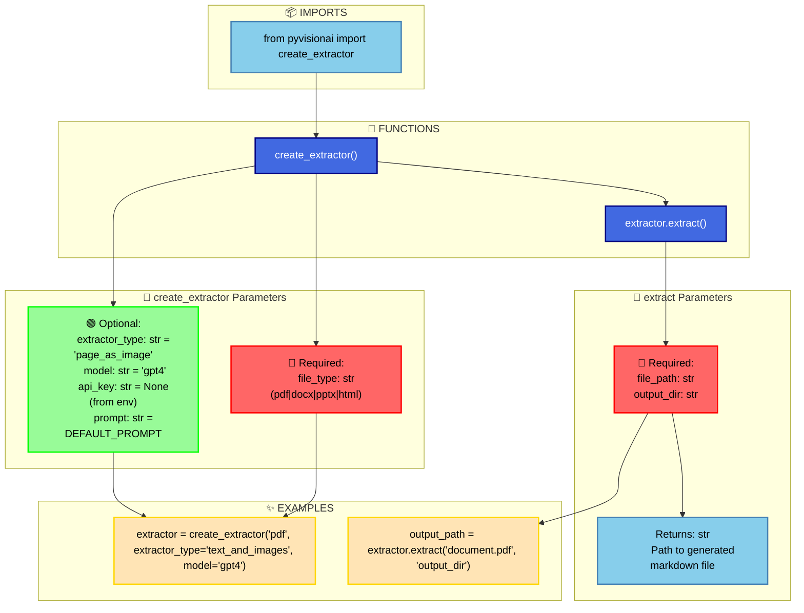

```mermaid
graph TD
    classDef function fill:#4169E1,stroke:#000080,stroke-width:2px,color:white
    classDef required fill:#ff6666,stroke:#ff0000,stroke-width:2px,color:black
    classDef optional fill:#98FB98,stroke:#00ff00,stroke-width:2px,color:black
    classDef default fill:#87CEEB,stroke:#4682B4,stroke-width:2px,color:black
    classDef example fill:#FFE4B5,stroke:#FFD700,stroke-width:2px,color:black

    subgraph IMPORTS["📦 IMPORTS"]
        Import["from pyvisionai import create_extractor"]
    end

    subgraph FUNCTIONS["🔵 FUNCTIONS"]
        Create["create_extractor()"]
        Extract["extractor.extract()"]
    end

    subgraph EXAMPLES["✨ EXAMPLES"]
        CreateExample["extractor = create_extractor('pdf', extractor_type='text_and_images', model='gpt4')"]
        ExtractExample["output_path = extractor.extract('document.pdf', 'output_dir')"]
    end

    subgraph CREATE_PARAMS["📝 create_extractor Parameters"]
        CreateRequired["🔴 Required:
        file_type: str (pdf|docx|pptx|html)"]

        CreateOptional["🟢 Optional:
        extractor_type: str = 'page_as_image'
        model: str = 'gpt4'
        api_key: str = None (from env)
        prompt: str = DEFAULT_PROMPT"]
    end

    subgraph EXTRACT_PARAMS["📝 extract Parameters"]
        ExtractRequired["🔴 Required:
        file_path: str
        output_dir: str"]

        ExtractReturn["Returns: str
        Path to generated markdown file"]
    end

    Import --> Create
    Create --> CreateRequired & CreateOptional
    Create --> Extract
    Extract --> ExtractRequired --> ExtractReturn
    CreateRequired & CreateOptional --> CreateExample
    ExtractRequired --> ExtractExample

    class Create,Extract function
    class CreateRequired,ExtractRequired required
    class CreateOptional optional
    class CreateExample,ExtractExample example
```
