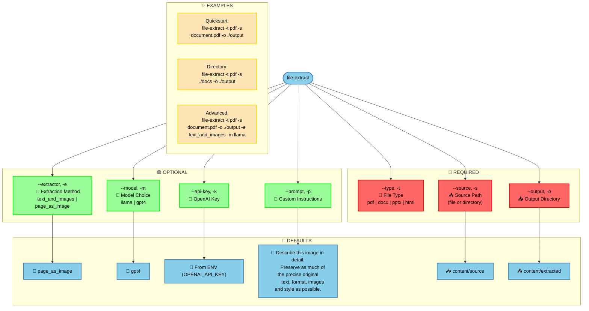

## Default Prompt

The tool uses a single default prompt for all extraction methods and models:

```
"Describe this image in detail. Preserve as much of the precise original text, format, images and style as possible."
```

This prompt is designed to:
1. Extract text content accurately
2. Maintain original formatting
3. Describe visual elements
4. Preserve document structure

## Custom Prompt Guidelines

When using custom prompts, ensure they include:

1. **For Both Methods**
   - Clear instruction to describe visual content
   - Request for maintaining precision and detail

2. **For page_as_image Method**
   - Additional instruction to extract and preserve text content
   - Example: "Extract all text exactly as shown and describe any visual elements in detail"

3. **For text_and_images Method**
   - Focus on visual description (text is handled separately)
   - Example: "Describe all visual elements, diagrams, and their relationships"

## Specialized Prompts by Use Case

| Use Case | Extraction Method | Recommended Prompt |
|----------|------------------|-------------------|
| Technical Documentation | page_as_image | "Extract all code snippets, technical terms, and command examples. For diagrams, describe the technical architecture and components shown." |
| Business Documents | page_as_image | "Extract key business metrics, financial figures, and trends. For charts, provide detailed analysis of the data presented." |
| Academic Papers | page_as_image | "Extract research methodology, key findings, and citations. For figures, describe the experimental setup and results shown." |
| Charts & Diagrams | text_and_images | "Analyze the chart type, axes labels, and data trends. Provide key insights and numerical values where visible." |
| Tables | text_and_images | "Extract table headers and all cell contents precisely. Maintain the tabular structure in the description." |
