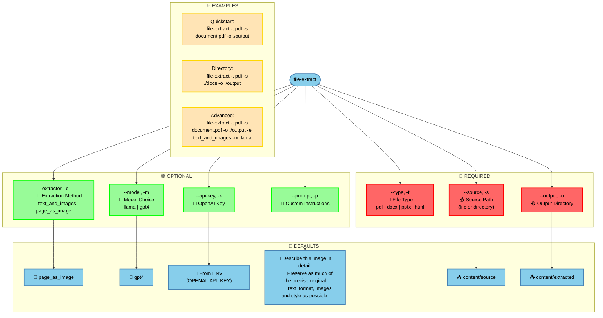

```mermaid
graph TD
    classDef required fill:#ff6666,stroke:#ff0000,stroke-width:2px,color:black
    classDef optional fill:#98FB98,stroke:#00ff00,stroke-width:2px,color:black
    classDef default fill:#87CEEB,stroke:#4682B4,stroke-width:2px,color:black
    classDef example fill:#FFE4B5,stroke:#FFD700,stroke-width:2px,color:black

    CLI(["file-extract"])

    subgraph EXAMPLES["✨ EXAMPLES"]
        Basic["Quickstart:
        file-extract -t pdf -s document.pdf -o ./output"]

        Directory["Directory:
        file-extract -t pdf -s ./docs -o ./output"]

        Advanced["Advanced:
        file-extract -t pdf -s document.pdf -o ./output -e text_and_images -m llama"]
    end

    subgraph OPTIONAL["🟢 OPTIONAL"]
        Extractor["--extractor, -e
        📄 Extraction Method
        text_and_images | page_as_image"]

        Model["--model, -m
        🤖 Model Choice
        llama | gpt4"]

        Key["--api-key, -k
        🔑 OpenAI Key"]

        Prompt["--prompt, -p
        💭 Custom Instructions"]
    end

    subgraph REQUIRED["🔴 REQUIRED"]
        Type["--type, -t
        📄 File Type
        pdf | docx | pptx | html"]

        Source["--source, -s
        📥 Source Path
        (file or directory)"]

        Output["--output, -o
        📤 Output Directory"]
    end

    subgraph DEFAULTS["🔵 DEFAULTS"]
        ExtractorDefault["📄 page_as_image"]
        ModelDefault["🤖 gpt4"]
        KeyDefault["🔑 From ENV (OPENAI_API_KEY)"]
        PromptDefault["💭 Describe this image in detail.
        Preserve as much of the precise original
        text, format, images and style as possible."]
        SourceDefault["📥 content/source"]
        OutputDefault["📤 content/extracted"]
    end

    CLI --> Type & Source & Output
    CLI --> Extractor & Model & Key & Prompt

    Extractor --> ExtractorDefault
    Model --> ModelDefault
    Key --> KeyDefault
    Prompt --> PromptDefault
    Source --> SourceDefault
    Output --> OutputDefault

    class Type,Source,Output required
    class Extractor,Model,Key,Prompt optional
    class ExtractorDefault,ModelDefault,KeyDefault,PromptDefault,SourceDefault,OutputDefault default
    class Basic,Directory,Advanced example
```
