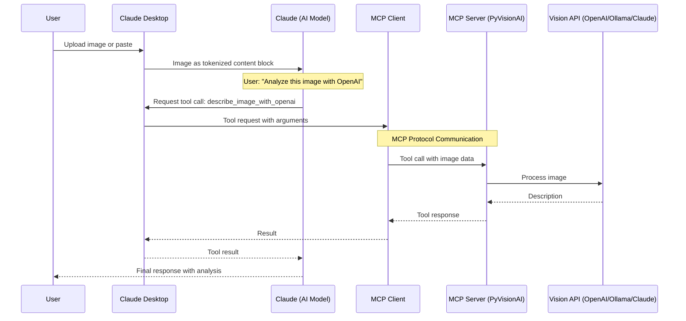

# How Images Flow Through MCP to PyVisionAI

## Overview

When an AI agent (like Claude) needs to analyze an image using your MCP server, the image data flows through several layers. Understanding this flow is crucial for building robust MCP implementations.

## The Image Data Flow



## Key Concepts

### 1. Image Sources in Claude Desktop

Users can provide images to Claude in several ways:
- **Direct upload** - Using the paperclip icon
- **Clipboard paste** - Ctrl/Cmd+V
- **MCP Resources** - Selecting from available MCP resources

### 2. How Claude Processes Images

When an image is uploaded to Claude:
1. The image is **tokenized** (~1,500 tokens for typical images)
2. Claude can "see" and analyze the image directly
3. The original binary data is NOT directly accessible to Claude

### 3. The MCP Bridge Problem

Here's the challenge: When Claude wants to use an MCP tool to analyze an image:
- Claude has the tokenized representation (can see the image)
- The MCP server needs the actual image data (binary/base64)
- The tokenized image cannot be reconstructed back to binary

## Solutions for Image Handling in MCP

### Solution 1: Resource-Based Approach (Current Limitation)

MCP Resources can expose images that both Claude and the MCP server can access:

```python
# MCP server exposes images as resources
@app.list_resources()
async def list_resources():
    return [
        Resource(
            uri="image://screenshots/latest.png",
            name="Latest Screenshot",
            mimeType="image/png"
        )
    ]

@app.read_resource()
async def read_resource(uri: str) -> bytes:
    if uri == "image://screenshots/latest.png":
        with open("screenshots/latest.png", "rb") as f:
            return base64.b64encode(f.read()).decode()
```

**Limitation**: Claude Desktop (v0.78) has size restrictions for resources (~1MB).

### Solution 2: Tool with Image URL/Path

The tool accepts a file path or URL instead of the image data:

```python
@app.tool()
async def analyze_image_from_path(
    image_path: str,
    model: str = "gpt-4o-mini"
) -> str:
    """Analyze an image from a file path or URL"""
    # Read the image from the specified path
    if image_path.startswith("http"):
        # Download from URL
        image_data = download_image(image_path)
    else:
        # Read from local file
        with open(image_path, "rb") as f:
            image_data = f.read()

    # Process with vision model
    return process_image(image_data, model)
```

### Solution 3: Base64 in Tool Arguments

The tool accepts base64-encoded image data directly:

```python
@app.tool()
async def analyze_image_base64(
    image_base64: str,
    model: str = "gpt-4o-mini"
) -> str:
    """Analyze a base64-encoded image"""
    # Decode the base64 image
    image_data = base64.b64decode(image_base64)

    # Process with vision model
    return process_image(image_data, model)
```

**Note**: This requires the host application to provide the base64 data.

### Solution 4: Hybrid Approach (Recommended)

Combine multiple methods for flexibility:

```python
@app.tool()
async def analyze_image(
    image_source: str,
    source_type: Literal["url", "path", "base64", "resource"] = "path",
    model: str = "gpt-4o-mini"
) -> str:
    """
    Analyze an image from various sources.

    Args:
        image_source: URL, file path, base64 data, or resource URI
        source_type: Type of the image source
        model: Vision model to use
    """
    if source_type == "url":
        image_data = download_image(image_source)
    elif source_type == "path":
        with open(image_source, "rb") as f:
            image_data = f.read()
    elif source_type == "base64":
        image_data = base64.b64decode(image_source)
    elif source_type == "resource":
        # Fetch from MCP resource
        image_data = await fetch_resource(image_source)

    return process_image(image_data, model)
```

## FastAPI-MCP Integration Considerations

When using `fastapi-mcp`, the tool parameters are automatically exposed to the AI agent. However, for image handling:

1. **Avoid large base64 in arguments** - Token limits constrain tool call sizes
2. **Prefer references over data** - Use paths, URLs, or resource URIs
3. **Support multiple input methods** - Different scenarios require different approaches

## Current PyVisionAI MCP Implementation

Our current FastAPI endpoints expect file uploads, but for MCP tools, we should adapt:

```python
# Instead of expecting multipart uploads
@app.post("/api/v1/describe/openai")
async def describe_image_openai_endpoint(
    file: UploadFile = File(...)
):
    # Current implementation

# Add MCP-friendly tool
@app.tool()
async def describe_image_with_openai(
    image_path: str,  # Local file path
    prompt: str = "Describe this image",
    model: str = "gpt-4o-mini"
) -> str:
    """
    Use OpenAI to analyze an image from a file path.
    The image should be accessible on the local filesystem.
    """
    # Implementation that reads from file path
```

## Best Practices

1. **Document image source requirements** clearly in tool descriptions
2. **Validate image accessibility** before processing
3. **Handle errors gracefully** with meaningful messages
4. **Consider security** - validate paths and URLs
5. **Optimize for token efficiency** - return concise, relevant descriptions

## Future Enhancements

As MCP evolves, we might see:
- Native binary data support in tool arguments
- Larger resource size limits
- Direct integration with host application file handling
- Standardized image reference protocols

For now, the hybrid approach with support for multiple image sources provides the most flexibility for different use cases.
